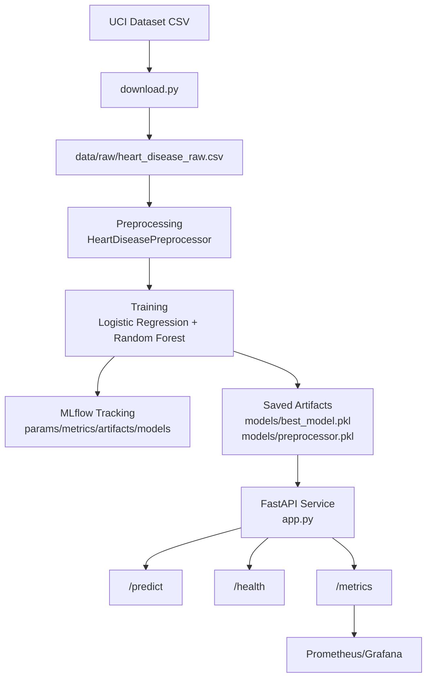

# Heart Disease MLOps Report

## Setup & Reproducibility

- Environment: environment is set up using uv. For that you have to install uv first. Follow: https://docs.astral.sh/uv/
- Install UV: `pip install uv`
- Install nox: `uv pip install --system nox nox-uv`
- Set up development environment: `uv nox -s dev`
- Set the dev environment available at `.nox/dev`.
- Data: `python download.py` downloads raw CSV; cleaned data lives in `data/processed/heart_disease_clean_binary.csv`.
- Training: `python -c "from src.training import train_pipeline; train_pipeline('data/raw/heart_disease_raw.csv')"` saves `models/best_model.pkl` and `models/preprocessor.pkl`.
- Tests: `pytest tests/ -v` for preprocessing sanity.
- Serving: `uvicorn app:app --reload` (or Docker/K8s options below). API docs at `http://localhost:8000/docs`.

For a cleaner, assignment-aligned writeup, see the documentation pages under `doc/`. The built MkDocs site is available at `site/index.html`.

## Data & EDA

- Dataset: UCI Heart Disease (14+ clinical features, binary target). Raw download handled in `download.py`.
- Cleaning: NaN handling and column normalization performed by `HeartDiseasePreprocessor` in `src/preprocessing.py`.

## Feature Engineering & Models

- Preprocessing: numeric median fill + `StandardScaler`; categorical label encoding; column order enforced to avoid training/serving drift.
- Models: Logistic Regression and Random Forest (grid search). Metrics include accuracy, precision, recall, F1, ROC-AUC; feature importance plot saved to `logs/feature_importance.png`.
- Best model selected by test AUC and persisted to `models/best_model.pkl`; preprocessor saved to `models/preprocessor.pkl`.

## Experiment Tracking (MLflow)

- Experiment name: `heart-disease-mlops`.
- Parameters, metrics, and artifacts (including feature importance plot) logged per run.
- Launch UI: `mlflow ui --host localhost --port 5000` → `http://localhost:5000`.
- To simplify starting the ui and set up run nox session `nox -s mlflow_ui`.

## Packaging, Containerization, Deployment

- Docker: `Dockerfile` builds FastAPI service with model artifacts mounted at `/app/models`; run via `docker run -p 8000:8000 -v $(pwd)/models:/app/models:ro heart-disease-mlops:latest`.
- Kubernetes: manifests in `k8s/deployment.yaml` (deployment + service + HPA). Probes hit `/health`; service exposed as LoadBalancer. Prometheus annotations included for `/metrics`.
- Health & inference checks: `curl http://localhost:8000/health` and POST `/predict` with sample JSON from `README.md`.

## CI/CD & Testing Notes

- Unit tests reside in `tests/`; extend coverage to training and API schema as needed.
- The run artifacts/screenshots to are available under `docs/images/screenshots/`.

## Monitoring & Logging

- Structured logs written to `logs/api.log`; set verbosity via `LOG_LEVEL`.
- Request/response metrics exported at `/metrics` (Prometheus). Sample config: `monitoring/prometheus.yml`.
- Quick start Prometheus: `docker run -p 9090:9090 -v $(pwd)/monitoring/prometheus.yml:/etc/prometheus/prometheus.yml prom/prometheus`; optional Grafana: `docker run -d -p 3000:3000 grafana/grafana` (add Prom data source at `http://host.docker.internal:9090`).
- K8s manifests include `prometheus.io/*` annotations for automatic scraping.
- Screenshots included (in `screenshots/`):
  - `monitoring-targets.png` (Prometheus targets page UP).
  - `monitoring-requests-total.png` (`sum by(endpoint) (heart_api_requests_total)`).
  - `monitoring-requests-rate-v1.png` and `monitoring-requests-rate-v2.png` (`sum by(endpoint) (rate(heart_api_requests_total[1m]))`).
  - `monitoring-metrics-terminal-view.png` (`/metrics` output view).
  - `curl-call-api-health.png` (API call/logging view).
- CI/CD: GitHub Actions workflow at `.github/workflows/ci.yml` (lint + pytest).

## Architecture (high level)

## API Quick Reference

- `GET /health` – readiness check; reports model load status.
- `POST /predict` – returns `prediction`, `confidence`, `risk_level`.
- `GET /metrics` – Prometheus scrape endpoint for request counts/latency.

## Repository

- [GitHub - Heart Disease MLOps](https://github.com/Sid245439/heart-disease-mlops)
- [Documentation Site](https://sid245439.github.io/heart-disease-mlops/site/index.html)
- [End to End Demo Video](https://wilpbitspilaniacin0-my.sharepoint.com/:v:/g/personal/2024ab05302_wilp_bits-pilani_ac_in/IQA2KcYgXN0vS7Dwpymkzkq7AYuNU9Fs0d5Bo61-Q4LghA8?e=rRchLe&nav=eyJyZWZlcnJhbEluZm8iOnsicmVmZXJyYWxBcHAiOiJTdHJlYW1XZWJBcHAiLCJyZWZlcnJhbFZpZXciOiJTaGFyZURpYWxvZy1MaW5rIiwicmVmZXJyYWxBcHBQbGF0Zm9ybSI6IldlYiIsInJlZmVycmFsTW9kZSI6InZpZXcifX0%3D)

Note: For detailed instructions, code explanations, and screenshots, please refer to the full documentation site built with MkDocs located in the `site/` directory. The site is served using github pages. Please access it via the link above.
