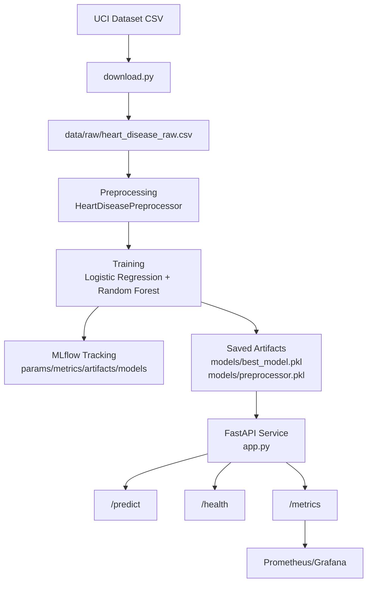

# Architecture

## High-level flow

## Components

- Data acquisition: `download.py`
- Preprocessing: `src/preprocessing.py` (fit/transform, NaN safety, consistent column ordering)
- Training: `src/training.py`
  - Grid search + cross-validation
  - Logs to MLflow
  - Saves final artifacts to `models/`
- Serving: `app.py` (FastAPI)
- Monitoring: Prometheus scrape config in `monitoring/prometheus.yml`
- Deployment: Kubernetes manifest in `k8s/deployment.yaml`
- Automation: `noxfile.py` + GitHub Actions workflows
