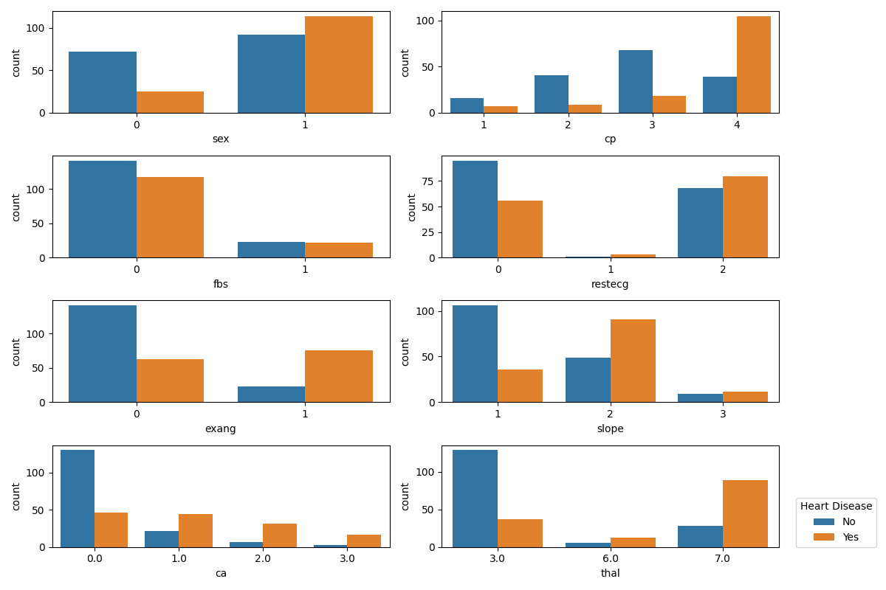
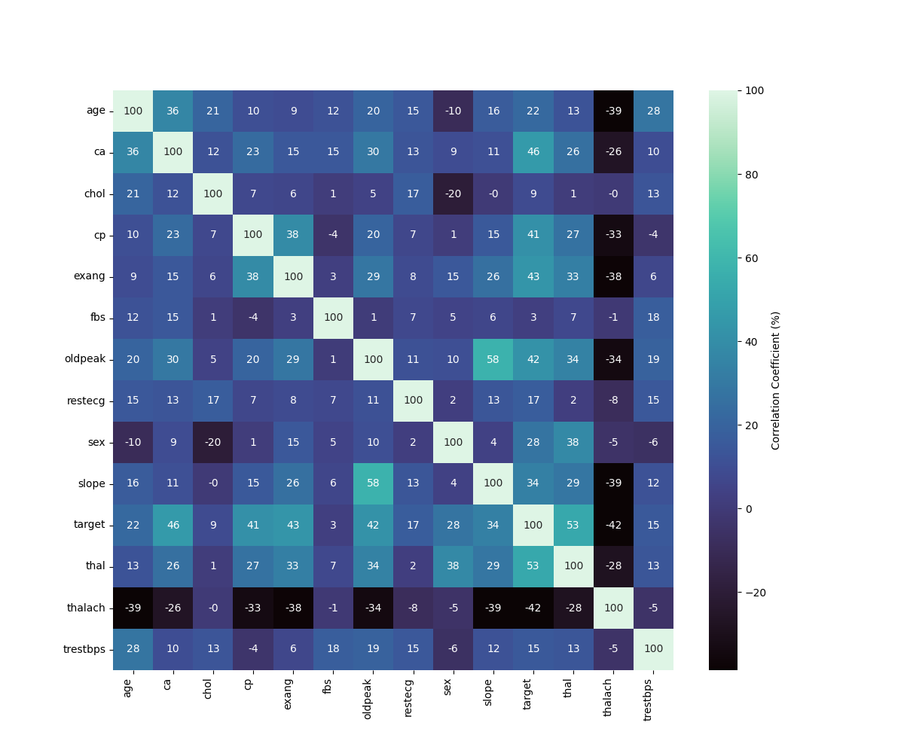

# Exploratory Data Analysis (EDA) — Heart Disease UCI

This document captures the complete EDA process used in this project.

Primary EDA source:

- Notebook: `exploration/eda.ipynb`
- Generated figures: `doc/images/`

## 1. Objective and Approach

**Goal:** Understand the Heart Disease UCI dataset’s structure, target definition, missingness, feature distributions, and relationships so we can design a robust preprocessing + modeling pipeline.

**Key EDA outputs (as required):**

- Target/class balance visualization
- Feature distribution plots (categorical and numerical)
- Correlation heatmap
- Basic statistical association check for categorical features

## 2. Dataset Acquisition

Two equivalent ways are supported in this repo:

1. **Reproducible download script (recommended for pipelines):**

- Script: `download_data.py`
- Output: `data/raw/heart_disease_raw.csv`

Run:

```bash
python download_data.py
```

This script downloads the data from the url `https://archive.ics.uci.edu/static/public/45/data.csv`. This is the 45th version of the data.

1. **Direct CSV read (used inside the EDA notebook):**

The notebook loads from:

- https://archive.ics.uci.edu/static/public/45/data.csv

## 3. Data Description (Features + Target)

The dataset contains the commonly used 14 attributes (UCI Heart Disease):

- `age`: age (years)
- `sex`: 1=male, 0=female
- `cp`: chest pain type (1–4)
- `trestbps`: resting blood pressure (mm Hg)
- `chol`: serum cholesterol (mg/dl)
- `fbs`: fasting blood sugar > 120 mg/dl (1=true, 0=false)
- `restecg`: resting ECG results (0–2)
- `thalach`: max heart rate achieved
- `exang`: exercise induced angina (1=yes, 0=no)
- `oldpeak`: ST depression induced by exercise relative to rest
- `slope`: slope of peak exercise ST segment (1–3)
- `ca`: number of major vessels (0–3)
- `thal`: thalassemia indicator (commonly 3, 6, 7)
- `num`: original diagnosis label (0–4)

### Target definition used in this project

The original `num` is multi-valued (`0,1,2,3,4`). To make this a **binary classification** problem:

- `target = 0` if `num == 0` (absence of disease)
- `target = 1` if `num != 0` (presence of disease)

After deriving `target`, the notebook drops `num` to avoid leakage and ambiguity.

## 4. Basic Data Quality Checks

The notebook performs initial inspection via:

- `df.info()` for dtypes and non-null counts
- `df.describe()` for numeric summary statistics

### Missing values

During inspection, two columns stand out as having missing values:

- `ca`
- `thal`

These are treated as **categorical** in analysis (even though they are encoded numerically) and are typically handled via **mode/most-frequent imputation** during preprocessing.

Note: for the Chi-square test in the notebook, missing rows are excluded using `dropna()` to keep the statistical test well-defined.

## 5. Class Balance (Target Distribution)

To validate the problem setup and understand potential imbalance, the notebook plots a countplot of `target`.


Interpretation (as observed in the notebook):

- The dataset is not extremely imbalanced, but class proportions should still be verified before choosing metrics and thresholds.

## 6. Feature-Type Grouping for EDA

For analysis, features are grouped into categorical vs numerical:

**Categorical (discrete, encoded) columns:**

```text
sex, cp, fbs, restecg, exang, slope, ca, thal
```

**Numerical (continuous/ordinal) columns:**

```text
age, trestbps, chol, thalach, oldpeak
```

This grouping drives the choice of plots and informs later preprocessing decisions (encoding and scaling).

## 7. Univariate Analysis (Distributions)

### 7.1 Categorical feature distributions by target

The notebook generates countplots for each categorical feature with `hue="target"` to compare category frequencies across the two classes.



Typical EDA takeaways from these plots:

- Some categorical features show visibly different distributions between `target=0` and `target=1`, which suggests predictive signal.
- Some categories are dominant within a feature (rare categories exist), which is important for encoding choices and potential regularization.

### 7.2 Numerical feature distributions by target

The notebook uses histogram + KDE overlays (`sns.histplot(..., kde=True)`) split by target.


Notebook observation captured in comments:

- Most numerical variables appear roughly bell-shaped except `oldpeak`, which is more skewed.

Implication for modeling (preprocessing decision driver):

- Standardization is generally suitable for most continuous features.
- Skewed features can sometimes benefit from alternative scaling (e.g., MinMax/robust scaling) or transformations, to be validated during model development.

## 8. Correlation Analysis

To identify linear relationships and potential multicollinearity, the notebook computes a correlation matrix and visualizes it using a heatmap (values shown as percentages).



Notebook conclusion:

- No pair of features exhibits extremely high correlation that would force removal purely due to multicollinearity concerns.
- Therefore, all features are retained for downstream model training (feature selection is deferred to modeling/validation).

## 9. Statistical Association for Categorical Features (Chi-square Test)

To quantify whether categorical features are associated with the target, the notebook runs a Chi-square test (`sklearn.feature_selection.chi2`) on the categorical subset (after dropping missing rows).

Result interpretation recorded in the notebook:

- Most categorical variables show statistically significant association with the target (p-value < 0.05).
- `fbs` is not significant in isolation (very high p-value), but is still retained because:
  - features can contribute jointly even if marginal association is weak
  - final decision should be made using cross-validated model performance

## 10. Reproducibility: How to Regenerate EDA Outputs

From a clean environment:

1. Run the notebook end-to-end:

- Open: `exploration/eda.ipynb`
- Run all cells
- Figures are saved to: `doc/images/`

Optional: a lightweight script also exists for quick checks:

- `src/eda.py` prints basic info and writes plots into `logs/`.

## 11. EDA Artifacts (for Report / Submission)

The notebook saves the following figures (submission-ready):

- `doc/images/heart_disease_target_distribution.png`
- `doc/images/heart_disease_categorical_distribution.png`
- `doc/images/heart_disease_numerical_distribution.png`
- `doc/images/heart_disease_correlation_matrix.png`
