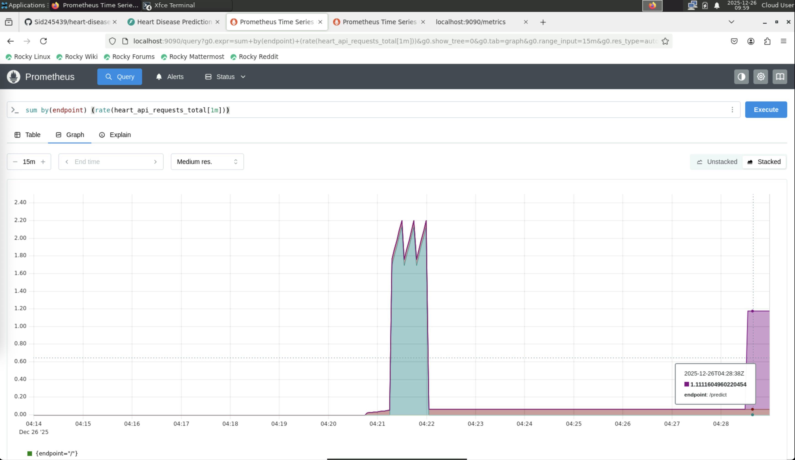
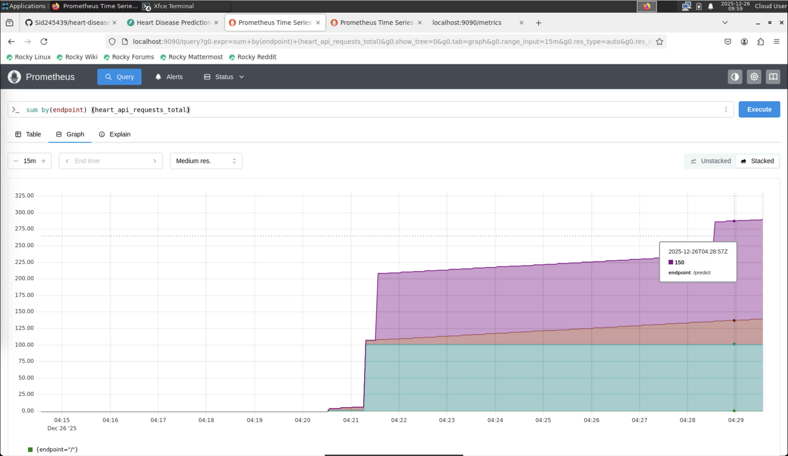
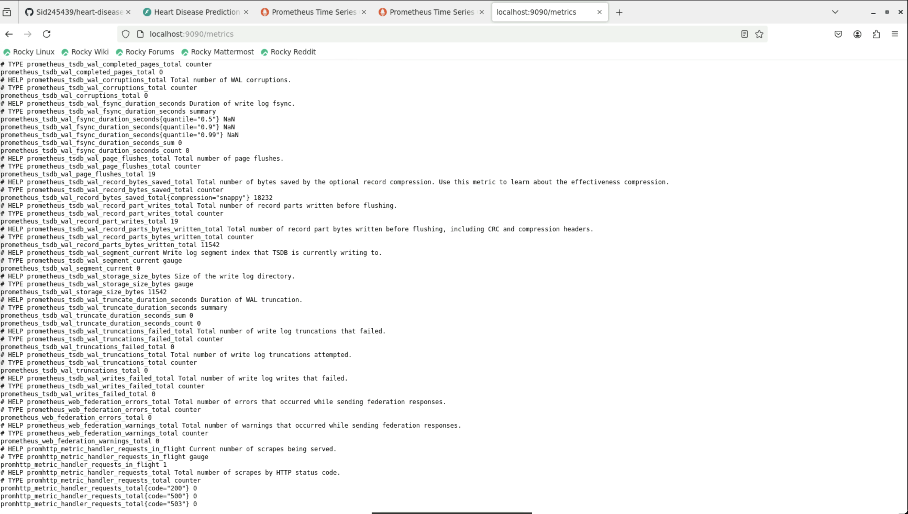
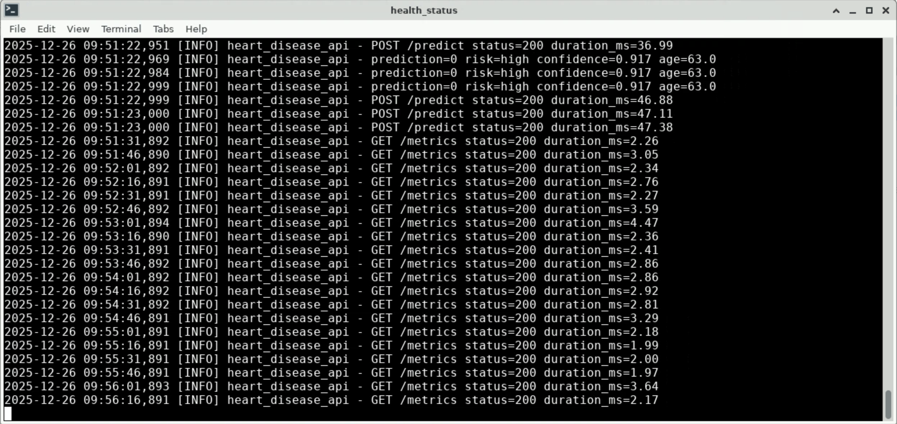

# Monitoring & Logging

## Logging

The API (`app.py`) uses Loguru and intercepts standard Python logging so Uvicorn/FastAPI logs are routed consistently.

- Log file: `logs/api.log`
- Configure level: `LOG_LEVEL` (e.g., `INFO`, `DEBUG`)

## Metrics (Prometheus)

The service exposes Prometheus metrics at:

- `GET /metrics`

Metrics include:

- `heart_api_requests_total{method,endpoint,http_status}`
- `heart_api_request_latency_seconds_bucket{endpoint,...}`

## Run Prometheus locally (Docker)

A sample scrape config exists at `monitoring/prometheus.yml`.

```bash
docker run -p 9090:9090 \
  -v $(pwd)/monitoring/prometheus.yml:/etc/prometheus/prometheus.yml \
  prom/prometheus
```

Windows PowerShell:

```powershell
docker run -p 9090:9090 `
  -v ${PWD}/monitoring/prometheus.yml:/etc/prometheus/prometheus.yml `
  prom/prometheus
```

Open:

- http://localhost:9090

Example queries:

- Requests by endpoint:
  - `sum by (endpoint) (heart_api_requests_total)`
- Request rate:
  - `sum by (endpoint) (rate(heart_api_requests_total[1m]))`

## Grafana (optional)

```bash
docker run -d -p 3000:3000 grafana/grafana
```

Add a Prometheus datasource:

- URL: `http://host.docker.internal:9090`

## What to screenshot for the report

- Prometheus Targets page showing the API as UP
- A chart for request rate
- A chart for request totals
- API `/metrics` output in the browser or terminal
- Sample `logs/api.log` lines after calling `/predict`

## Included screenshots (click to open)

These screenshots are stored in `doc/images/screenshots/` and published with GitHub Pages.

### Prometheus targets

[Open image](images/screenshots/monitoring-targets.png)


### Requests total

[Open image](images/screenshots/monitoring-requests-total.png)


### Request rate

[Open image (v1)](images/screenshots/monitoring-requests-rate-v1.png)



[Open image (v2)](images/screenshots/monitoring-requests-rate-v2.png)



### /metrics output

[Open image](images/screenshots/monitoring-metrics-terminal-view.png)



### API health proof

[Open image](images/screenshots/curl-call-api-health.png)


